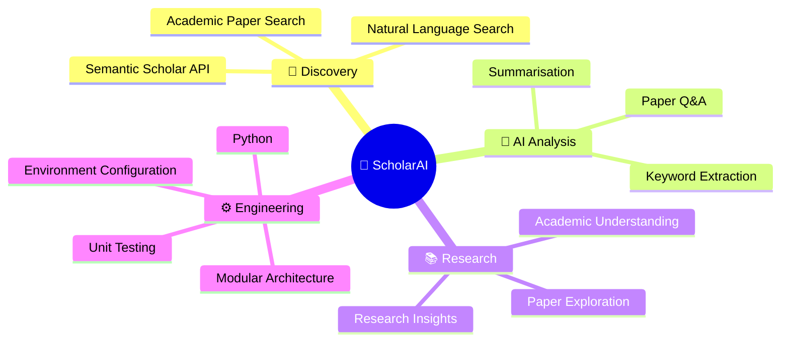
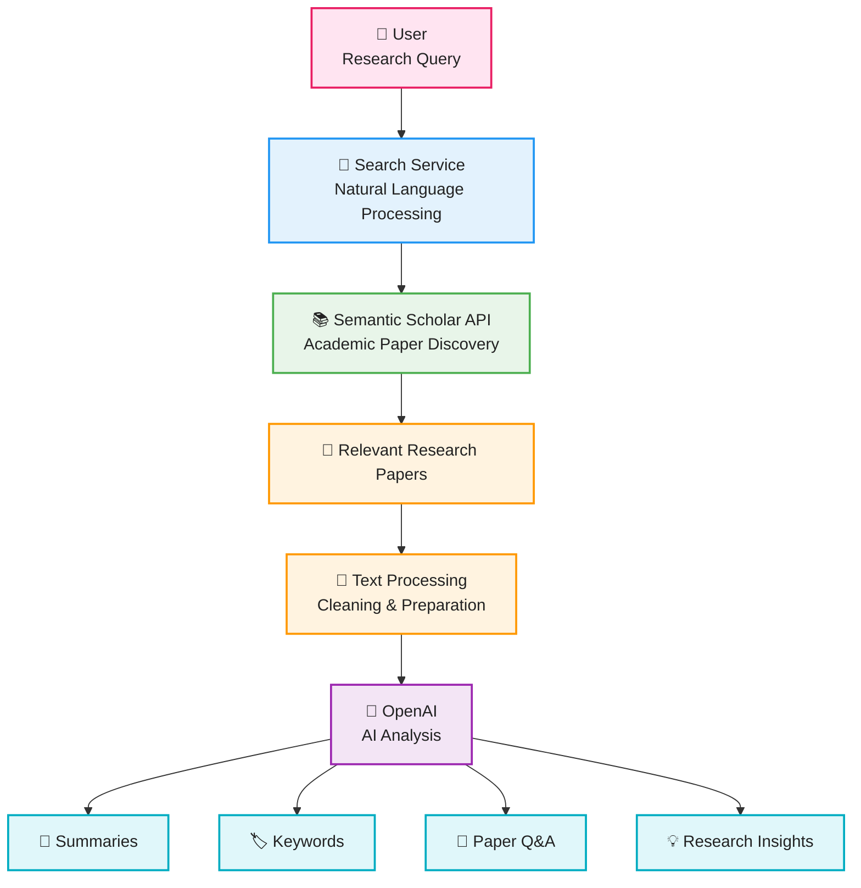
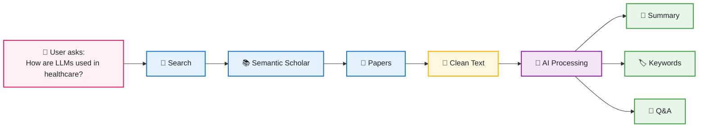
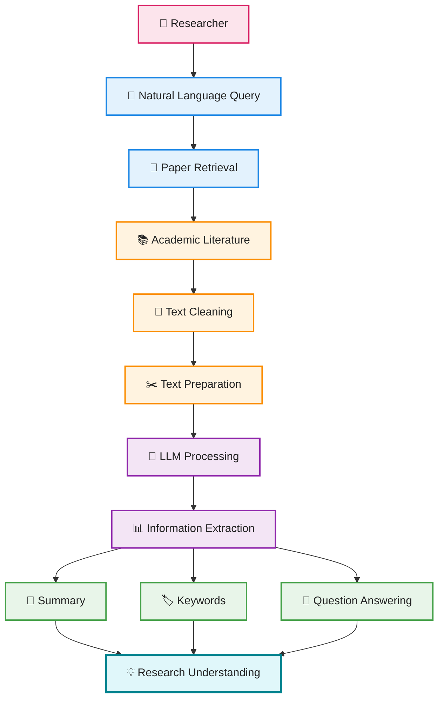
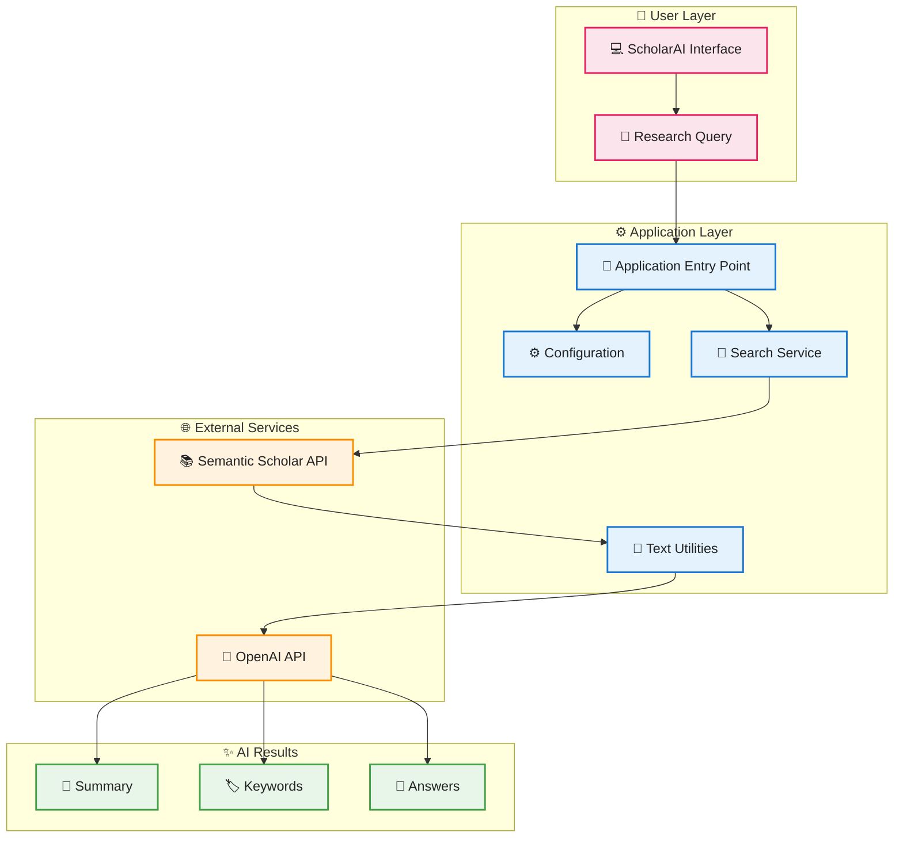
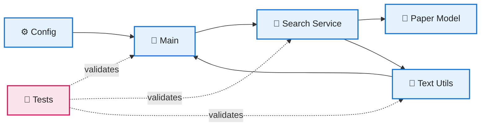

# 🔬 ScholarAI

<p align="center">
  <h3 align="center">🧠 AI-Powered Academic Research Assistant</h3>
</p>

<p align="center">
  <b>Search • Discover • Understand • Summarise • Research</b>
</p>

<p align="center">


</p>

---

## 🌟 Overview

**ScholarAI** is an AI-powered academic research assistant that helps users **discover, explore, and understand research papers using natural-language queries**.

It combines:

* 🔎 **Semantic Scholar API** for academic paper discovery
* 🤖 **OpenAI** for intelligent paper analysis
* 🧹 **Text processing** for preparing academic content
* 💬 **AI-powered Q&A** for interacting with papers
* 📝 **Summarisation** for quickly understanding research

Instead of manually going through large amounts of academic literature, ScholarAI aims to provide a more intelligent research workflow.

---

# 🚀 Core Features



---

# 🏗️ System Architecture

The complete ScholarAI pipeline:



---

# 🧠 How ScholarAI Works



---

# 🔄 AI Research Pipeline

ScholarAI can be viewed as a sequence of research-processing stages:



---

# 🧩 Application Architecture



---

# 📁 Project Structure

```text
ScholarAI/
│
├── 📦 app/
│   │
│   ├── __init__.py
│   ├── ⚙️ config.py
│   ├── 🚀 main.py
│   │
│   ├── 📚 models/
│   │   ├── __init__.py
│   │   └── 📄 paper.py
│   │
│   ├── 🔧 services/
│   │   ├── __init__.py
│   │   └── 🔎 search_service.py
│   │
│   └── 🛠️ utils/
│       ├── __init__.py
│       └── 🧹 text_utils.py
│
├── 🧪 tests/
│   ├── __init__.py
│   └── test_main.py
│
├── 🔐 .env.example
├── 📦 requirements.txt
├── 🧪 requirements-dev.txt
└── 📖 README.md
```

---

# 🧱 Component Responsibilities



---

# 🛠️ Tech Stack

```mermaid
flowchart TD

    TECH["ScholarAI Technology Stack"]

    PY["Python - Core Application"]
    OPEN["OpenAI - AI Processing"]
    SEM["Semantic Scholar - Paper Discovery"]
    TEST["Pytest - Testing"]
    ENV["Environment Variables - Configuration"]

    TECH --> PY
    TECH --> OPEN
    TECH --> SEM
    TECH --> TEST
    TECH --> ENV

    classDef root fill:#E1BEE7,stroke:#8E24AA,stroke-width:3px,color:#222;
    classDef tech fill:#E8F5E9,stroke:#43A047,stroke-width:2px,color:#222;

    class TECH root;
    class PY,OPEN,SEM,TEST,ENV tech;


----------------------------------------------------------------------------------------------

## Contributing

1. Fork the repo and create a feature branch.
2. Run `ruff check .` and `mypy app/` before opening a PR.
3. Add or update tests for any changed behaviour.

---

## License

MIT — see `LICENSE` for details.
